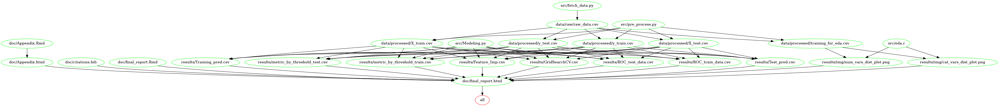

# Online Shopping Intention Predictor
- author: Lesley Miller, Cheng Min, Shivam Verma

## About
```{r setup, include = FALSE, warning = FALSE, message = FALSE, echo=FALSE}
library(here)
library(tidyverse, quietly = TRUE)
library(knitr)
knitr::opts_chunk$set(echo = FALSE)
knitr::opts_knit$set(root.dir = here::here())
```

```{r load data, message = FALSE, include=FALSE}
X_train_pred <- read_csv("results/Training_pred.csv")
X_test_pred <- read_csv("results/Test_pred.csv")

# train data metrics
clf_rate_tr <- round(sum(X_train_pred$skl_predict==X_train_pred$Revenue)/nrow(X_train_pred), digits = 3)*100
miss_clf_rate_tr <- 1 - clf_rate_tr

precision_tr <- nrow(X_train_pred %>% filter(skl_predict==TRUE & Revenue==TRUE))/nrow(X_train_pred %>% filter(skl_predict==TRUE))
recall_tr <- nrow(X_train_pred %>% filter(skl_predict==TRUE & Revenue==TRUE))/nrow(X_train_pred %>% filter(Revenue==TRUE))
f1_tr <- round(2*precision_tr*recall_tr/(precision_tr + recall_tr), digits = 3)

precision_tr <- round(precision_tr, digits = 3)

# test data metrics
clf_rate <- round(sum(X_test_pred$skl_predict==X_test_pred$Revenue)/nrow(X_test_pred), digits = 3)*100
miss_clf_rate <- 1 - clf_rate

precision <- nrow(X_test_pred %>% filter(skl_predict==TRUE & Revenue==TRUE))/nrow(X_test_pred %>% filter(skl_predict==TRUE))
recall <- nrow(X_test_pred %>% filter(skl_predict==TRUE & Revenue==TRUE))/nrow(X_test_pred %>% filter(Revenue==TRUE))
f1 <- round(2*precision*recall/(precision + recall), digits = 3)

```

Here we attempt to build a classification model using the light gradient boosting algorithm which can use webpage metrics from a given online shopping website to predict whether the final action of a new customer is purchasing (i.e., Revenue is TRUE) or not (i.e., Revenue is FALSE). Our final classifier performed well on an unseen test data set, with the F1 score of `r f1` and the test accuray calculated to be `r clf_rate`%. The precision and recall of our classifier on the test set are `r round(precision, digits=3)` and `r round(recall, digits=3)` respectively. Due to substantially high number of false positives & negatives, we recommend further iteration to improve this model. 


The data set used in this project is of online shopping webpage metrics created by C. Okan Sakar, S. Olcay Polat, Mete Katircioglu & Yomi Kastro[@sakar2019real]. It was sourced from the UCI Machine Learning Repository[@Dua] and can be found [here](https://archive.ics.uci.edu/ml/datasets/Online+Shoppers+Purchasing+Intention+Dataset). Each row in the data set represents summary behavior extracted from the URL information ,including the final action (purchase or not) and several other measurements (e.g., Number of Distinct Product Related pages, Time spent on Product Related pages, closeness of site visitng time to a special day, etc.). 

## Report
The final report can be found [here](https://ubc-mds.github.io/DSCI522_309/doc/final_report.html).

### Diagrams
The dependency diagram below illustrates script orders and dependencies for our Makefile and was created using `makefile2graph`, click [here](https://github.com/UBC-MDS/DSCI522_309/blob/master/results/img/Makefile.png) for the original graph:



### Usage:

To replicate the analysis, there are two suggested ways to run this analysis:

#### 1. Using Docker
*note - the instructions in this section also depends on running this in a unix shell (e.g., terminal or Git Bash), if you are using Windows Command Prompt, replace `/$(pwd)` with PATH_ON_YOUR_COMPUTER.*

1. Install [Docker](https://www.docker.com/get-started)
2. Download/clone this repository
3. Use the command line to navigate to the root of this downloaded/cloned repo
4. Type the following:

```
docker run --rm -v /$(pwd):"/DSCI522_309" chengmin/dsci522-group309:v1.0 bash -c "make -C /DSCI522_309 all"
```

5. To reset/undo the analysis, type the following:

```
docker run --rm -v /$(pwd):"/DSCI522_309" chengmin/dsci522-group309:v1.0 bash -c "make -C /DSCI522_309 clean"
```

#### 2. After installing all [dependencies](#dependencies) (does not depend on Docker)

1. Clone this repo, and using the command line, navigate to the root of this project.
2. To run the analysis, type the following commands:

```
make all
```

3. To reset/undo the analysis, type the following commands:

```
make clean
```

## Dependencies
- Python 3.7.4 and Python packages:
  - docopt==0.6.2
  - pandas==1.0.0
  - numpy==1.17.2
  - sklearn==0.22.1
  - lightgbm==2.3.0
- R version 3.6.2 and R packages:
  - knitr==1.27
  - tidyverse==1.3.0
  - caret==6.0.85
  - kableExtra==1.1.0
  - scales==1.1.0
  - docopt==0.6.1
  - testthat==2.3.1
  - data.table==1.12.8
  - here==0.1
  - pheatmap==1.0.12
- GNU make 4.2.1
  
## License
The Online Shopping Intention Predictor materials here are licensed under the Creative Commons Attribution 2.5 Canada License (CC BY 2.5 CA). If re-using/re-mixing please provide attribution and link to this webpage.

# References