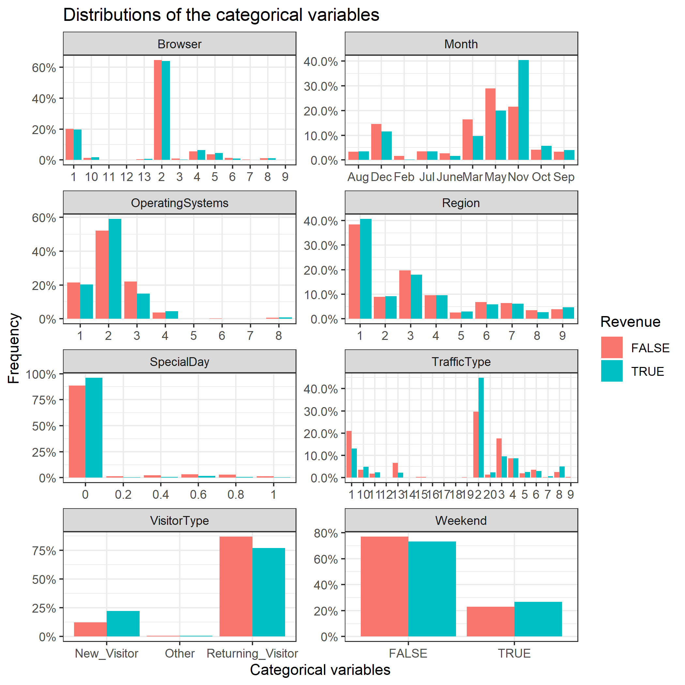
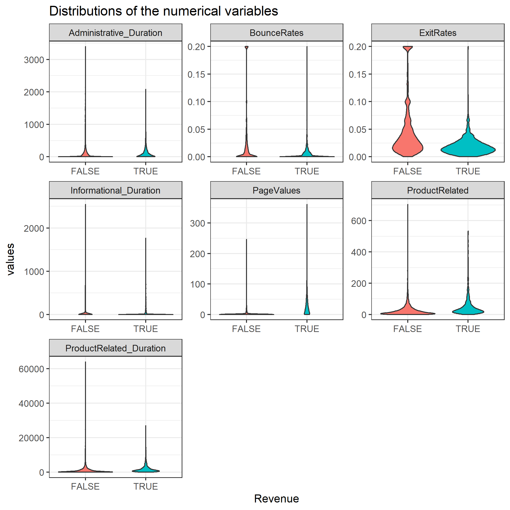
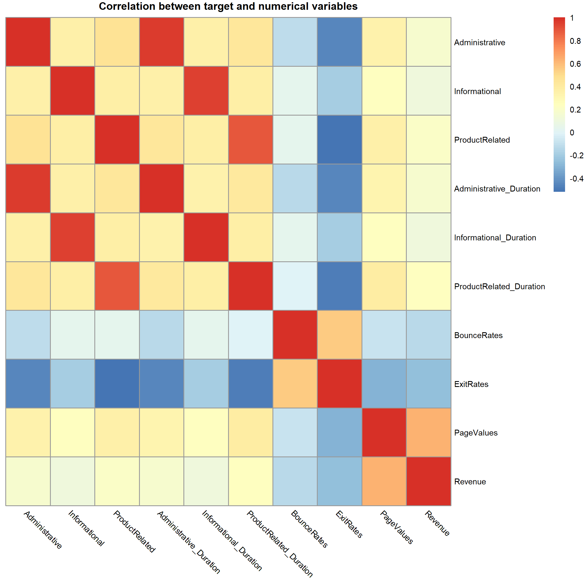

```{r setup, include = FALSE, warning = FALSE, message = FALSE, echo=FALSE}
library(here)
library(tidyverse, quietly = TRUE)
library(knitr)
library(caret)
suppressPackageStartupMessages(library(rlang))
suppressPackageStartupMessages(library(gridExtra))
knitr::opts_chunk$set(echo = FALSE)
knitr::opts_knit$set(root.dir = here::here())
```

```{r load data, message = FALSE}
cat_vars_expo <- readRDS("results/cat_vars_expo.rds")
quantile_dist <- read_csv("results/quantile_dist.csv")
feature_importance_df <- read_csv("results/Feature_Imp.csv")
best_hyperparams <- read_csv("results/GridSearchCV.csv")

X_train_pred <- read_csv("results/Training_pred.csv")
X_test_pred <- read_csv("results/Test_pred.csv")

```

## Description of the variables, [data source](https://archive.ics.uci.edu/ml/datasets/Online+Shoppers+Purchasing+Intention+Dataset)

| S No. | Variable | Description |
| ----------- | ----------- | ----------- |
| 1 | `Administrative` | Number of Distinct administrative pages |
| 2 | `Informational` | Number of Distinct Informational pages |
| 3 | `ProductRelated` | Number of Distinct Product Related pages |
| 4 | `Administrative_Duration` | Time(in seconds) spent on Administrative pages |
| 5 | `Informational_Duration` | Time(in seconds) spent on Informational pages |
| 6 | `ProductRelated_Duration` | Time(in seconds) spent on Product Related pages |
| 7 | `BounceRates` | Average bounce rate of all web-pages visited by user. For a web-page its the percentage of people who visit the website from that webpage and left without raising any other request |
| 8 | `ExitRates` | Average exit rate of all web-pages visited by user: For a web-page its the percentage of people who exited the website from that webpage |
| 9 | `PageValues` | Average page value of all web-pages visited by user: For a web-page its the average dollar-value of that page which the user visited before completing the transaction |
| 10 | `SpecialDay` | The closeness of site visitng time to a special day (higher chances of a session resulting in a transaction) |
| 11 | `OperatingSystems` | Operating system used by the user |
| 12 | `Month` | Month of Year |
| 13 | `Browser` | Browser used by the user |
| 14 | `Region` | Geographic region |
| 15 | `TrafficType` | Type of Channel user by the user to arrive at the website |
| 16 | `VisitorType` | Type of the visitor |
| 17 | `Weekend` | Weekend indicator |
| 18 | `Revenue` | Revenue transaction indicator |


```{r categorical variable summary tables }
### make Summary tables of categorical variables 
# convert tables into tibbles 

df <- as.data.frame(cat_vars_expo$SpecialDay)
tb1 <- as_tibble(df)
colnames(tb1) <- c("Special Day", "Percentage of Shopping Sessions")

df2 <- as.data.frame(cat_vars_expo$Month)
tb2 <- as_tibble(df2)
colnames(tb2) <- c("Month", "Percentage of Shopping Sessions")

df3 <- as.data.frame(cat_vars_expo$OperatingSystems)
tb3 <- as_tibble(df2)
colnames(tb3) <- c("Operating Systems", "Percentage of Shopping Sessions")

df4 <- as.data.frame(cat_vars_expo$Browser)
tb4 <- as_tibble(df4)
colnames(tb4) <- c("Browser", "Percentage of Shopping Sessions")

df5 <- as.data.frame(cat_vars_expo$Region)
tb5 <- as_tibble(df5)
colnames(tb5) <- c("Region", "Percentage of Shopping Sessions")

df6 <- as.data.frame(cat_vars_expo$TrafficType)
tb6 <- as_tibble(df6)
colnames(tb6) <- c("Traffict Type", "Percentage of Shopping Sessions")

df7 <- as.data.frame(cat_vars_expo$VisitorType)
tb7 <- as_tibble(df7)
colnames(tb7) <- c("Visitor Type", "Percentage of Shopping Sessions")

df8 <- as.data.frame(cat_vars_expo$Weekend)
tb8 <- as_tibble(df8)
colnames(tb8) <- c("Weekend", "Percentage of Shopping Sessions")

df9 <- as.data.frame(cat_vars_expo$Revenue)
tb9 <- as_tibble(df9)
colnames(tb9) <- c("Revenue", "Percentage of Shopping Sessions")


### plot the categorical tables 

kable(tb1,
      caption = "Distribution of Special Day")

kable(tb2,
      caption = "Distribution of Month")
kable(tb3,
      caption = "Distribution of Operating Systems")
kable(tb4,
      caption = "Distribution of Browser")
kable(tb5,
      caption = "Distribution of Region")
kable(tb6,
      caption = "Distribution of Traffic Type")
kable(tb7,
      caption = "Distribution of Visitor Type")
kable(tb8,
      caption = "Distribution of Weekend")

kable(tb9,
      caption = "Distribution of Weekend and Revenue")

```

```{r numeric variable 1-4 summary tables}
kable(select(quantile_dist, colnames(quantile_dist[1:4])),
      caption = "Cumulative Distribution of Numberic Variables")
```
```{r numeric variable 5-8 summary tables}
kable(select(quantile_dist, probs, colnames(quantile_dist[5:8])),
      caption = "Cumulative Distribution of Numberic Variables")
```


# Project Summary


# Why it Matters


# Methods 
## Data Source

# turn this into written text not bullent points. 
- Each row represent a session by a user.  
- Each user has only 1 session in the dataset.  
- The data is for 1-year period.  
- ~15% sessions resulted in a purchase.

## Exploratory Data Analysis

```{r distribution of categorical variables, fig.cap="Distribution of Categorical Predictors",out.height='70%', out.width='70%', fig.align="center"}


```


```{r distribution of numvariables, fig.cap="Distribution of Quantitative Predictors", out.height='70%', out.width='70%', fig.align="center"}



```


```{r correlation matrix, fig.cap="Correlation Matrix", out.height='50%', out.width='50%', fig.align="center"}

```


```{r feature importance, fig.cap="Feature Importance", fig.width=6, fig.height=4, fig.align="center"}

# plot 10 most important features 
feature_importance_df %>% 
      filter(Feature_Imp > 40) %>% 
      ggplot(aes(x = reorder(col_names, -Feature_Imp), y = Feature_Imp)) + 
      geom_col() +
      labs(title = "Top 10 Most Important Features for Predicting Sales",
           x = "Features",
           y = "Weight of Importance") + 
      coord_flip() 
      
      
```

Feature Importance


## Modelling 

```{r confusion matrix, fig.width=4, fig.height=4, fig.align="center"}
# get the predicted and observed 
predicted <- as.factor(X_train_pred$skl_predict)
observed <- as.factor(X_train_pred$Revenue)

# make the confusion matrix object
confusion_matrix <- confusionMatrix(data = predicted, 
                                    reference = observed, 
                                    positive = "TRUE")

# extract the confusion matrix table 
confusion_matrix_table <- confusion_matrix$table

# convert confusion matrix to tibble 
confusion_matrix_tibble <- as_tibble(as.data.frame(confusion_matrix_table))
colnames(confusion_matrix_tibble) <- c("Predicted", "Observed", "Count")

# plot confusion matrix 
confusion_matrix_tibble %>% 
      ggplot(aes(x = Observed, y = Predicted)) + 
      geom_tile(aes(fill = Count, color = "white")) + 
      geom_text(aes(label = Count)) + 
      scale_fill_gradient(low = "blue", high = "red") + 
      theme(legend.position = "None") + 
      labs(title = "Confusion Matrix") + 
      theme(plot.title = element_text(hjust = 0.5, size = 14))


```
```{r model eval metrics}

# table of model evaluation scores 
confusion_matrix_scores <- tibble(Sensitivity = confusion_matrix$byClass[1],
                                  Specificity = confusion_matrix$byClass[2],
                                  Precision = confusion_matrix$byClass[5],
                                  Recall = confusion_matrix$byClass[6],
                                  F1_Score = confusion_matrix$byClass[7])
kable(confusion_matrix_scores,
      caption = "Model Evaluation Metrics")
```


# Results and Discussion 

## Limitations 

## Future Directions 
```{r echo=FALSE}
```


# References 