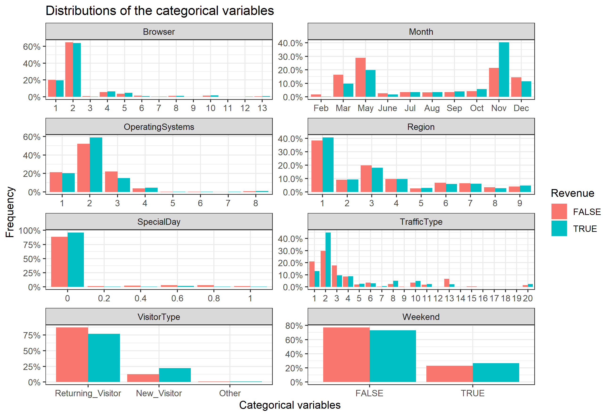
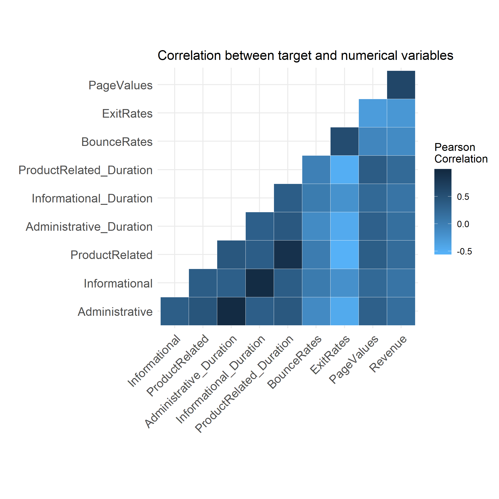

```{r setup, include = FALSE, warning = FALSE, message = FALSE, echo=FALSE}
library(here)
library(tidyverse, quietly = TRUE)
library(knitr)
suppressPackageStartupMessages(library(rlang))
suppressPackageStartupMessages(library(gridExtra))
knitr::opts_chunk$set(echo = FALSE)
knitr::opts_knit$set(root.dir = here::here())
```

```{r load data, message = FALSE, include=FALSE}
cat_vars_expo <- readRDS("results/cat_vars_expo.rds")
quantile_dist <- read_csv("results/quantile_dist.csv")
feature_importance_df <- read_csv("results/Feature_Imp.csv")
X_train <- read_csv("results/Training_pred.csv")
hyperpara <- read_csv("results/GridSearchCV.csv")
```


# Project Summary

Here we attempt to build a classification model using the light gradient boosting algorithm which can use webpage metrics from a given online shopping website to predict whether the revenue of a new customer is True (i.e., the customer purchased something) or False (i.e., the customer did not purchase anything). Our final classifier performed well on an unseen test data set, with the f1 score of `r` and the test accuray calculated to be `r`. The precision and recall of our classifier on the test set are `r` and `r` respectively. On the `r` test data cases, it correctly predicted `r`. However it incorrectly predicted `r` cases. (and these cases were FN?: predicting that a customer to purchase something when in fact there is no purchasing happens). Due to the high percentage of incorrect prediction in FN, we recommend further study to improve this model.

# Introduction (Why it Matters)


# Methods 
## Data Source

The data set used in this project is of online shopping webpage metrics created by C. Okan Sakar, S. Olcay Polat, Mete Katircioglu & Yomi Kastro [@]. It was sourced from the UCI Machine Learning Repository [@] and can be found [here](https://archive.ics.uci.edu/ml/datasets/Online+Shoppers+Purchasing+Intention+Dataset). Each row in the data set represents summary behavior extracted from the URL information , including the final action (purchase or not) and several other measurements (e.g., Number of Distinct Product Related pages, Time spent on Product Related pages, closeness of site visitng time to a special day, etc.). 

## Exploratory Data Analysis


> - Each row represent a session by a user.  
> - Each user has only 1 session in the dataset.  
> - The data is for 1-year period.  
> - ~15% sessions resulted in a purchase.


### Description of the variables, [data source](https://archive.ics.uci.edu/ml/datasets/Online+Shoppers+Purchasing+Intention+Dataset)

| No. | Variable | Description |
| ----------- | ----------- | ----------- |
| 1 | `Administrative` | Number of Distinct administrative pages |
| 2 | `Informational` | Number of Distinct Informational pages |
| 3 | `ProductRelated` | Number of Distinct Product Related pages |
| 4 | `Administrative_Duration` | Time(in seconds) spent on Administrative pages |
| 5 | `Informational_Duration` | Time(in seconds) spent on Informational pages |
| 6 | `ProductRelated_Duration` | Time(in seconds) spent on Product Related pages |
| 7 | `BounceRates` | Average bounce rate of all web-pages visited by user. For a web-page its the percentage of people who visit the website from that webpage and left without raising any other request |
| 8 | `ExitRates` | Average exit rate of all web-pages visited by user: For a web-page its the percentage of people who exited the website from that webpage |
| 9 | `PageValues` | Average page value of all web-pages visited by user: For a web-page its the average dollar-value of that page which the user visited before completing the transaction |
| 10 | `SpecialDay` | The closeness of site visitng time to a special day (higher chances of a session resulting in a transaction) |
| 11 | `OperatingSystems` | Operating system used by the user |
| 12 | `Month` | Month of Year |
| 13 | `Browser` | Browser used by the user |
| 14 | `Region` | Geographic region |
| 15 | `TrafficType` | Type of Channel user by the user to arrive at the website |
| 16 | `VisitorType` | Type of the visitor |
| 17 | `Weekend` | Weekend indicator |
| 18 | `Revenue` | Revenue transaction indicator |


```{r categorical variable summary tables, include=FALSE}
### make Summary tables of categorical variables 
# convert tables into tibbles 

df <- as.data.frame(cat_vars_expo$SpecialDay)
tb1 <- as_tibble(df)
colnames(tb1) <- c("Special Day", "Percentage of Shopping Sessions")

df2 <- as.data.frame(cat_vars_expo$Month)
tb2 <- as_tibble(df2)
colnames(tb2) <- c("Month", "Percentage of Shopping Sessions")

df3 <- as.data.frame(cat_vars_expo$OperatingSystems)
tb3 <- as_tibble(df2)
colnames(tb3) <- c("Operating Systems", "Percentage of Shopping Sessions")

df4 <- as.data.frame(cat_vars_expo$Browser)
tb4 <- as_tibble(df4)
colnames(tb4) <- c("Browser", "Percentage of Shopping Sessions")

df5 <- as.data.frame(cat_vars_expo$Region)
tb5 <- as_tibble(df5)
colnames(tb5) <- c("Region", "Percentage of Shopping Sessions")

df6 <- as.data.frame(cat_vars_expo$TrafficType)
tb6 <- as_tibble(df6)
colnames(tb6) <- c("Traffict Type", "Percentage of Shopping Sessions")

df7 <- as.data.frame(cat_vars_expo$VisitorType)
tb7 <- as_tibble(df7)
colnames(tb7) <- c("Visitor Type", "Percentage of Shopping Sessions")

df8 <- as.data.frame(cat_vars_expo$Weekend)
tb8 <- as_tibble(df8)
colnames(tb8) <- c("Weekend", "Percentage of Shopping Sessions")

df9 <- as.data.frame(cat_vars_expo$Revenue)
tb9 <- as_tibble(df9)
colnames(tb9) <- c("Revenue", "Percentage of Shopping Sessions")


### plot the categorical tables 

kableExtra::kable_styling(kable(tb1,
      caption = "Distribution of Special Day"), full_width = F)

kableExtra::kable_styling(kable(tb2,
      caption = "Distribution of Month"), full_width = F)

kableExtra::kable_styling(kable(tb3,
      caption = "Distribution of Operating Systems"), full_width = F)

kableExtra::kable_styling(kable(tb4,
      caption = "Distribution of Browser"), full_width = F)

kableExtra::kable_styling(kable(tb5,
      caption = "Distribution of Region"), full_width = F)

kableExtra::kable_styling(kable(tb6,
      caption = "Distribution of Traffic Type"), full_width = F)

kableExtra::kable_styling(kable(tb7,
      caption = "Distribution of Visitor Type"), full_width = F)

kableExtra::kable_styling(kable(tb8,
      caption = "Distribution of Weekend"), full_width = F)

kableExtra::kable_styling(kable(tb9,
      caption = "Distribution of Weekend and Revenue"), full_width = F)
```


```{r numeric variable summary table}

kableExtra::kable_styling(kable(quantile_dist,
      caption = "Cumulative Distribution of Numberic Variables"))
```






## Modelling 

```{r feature importance}

feature_importance_df %>% 
      filter(Feature_Imp > 40) %>% 
      ggplot(aes(x = reorder(col_names, -Feature_Imp), y = Feature_Imp)) + 
      geom_col() +
      labs(title = "Top 10 Most Important Features for Predicting Sales",
           x = "Features",
           y = "Weight of Importance") + 
      coord_flip() 
      
      
```

# Results and Discussion 
## Results

## Limitations 

## Future Directions 


# References 